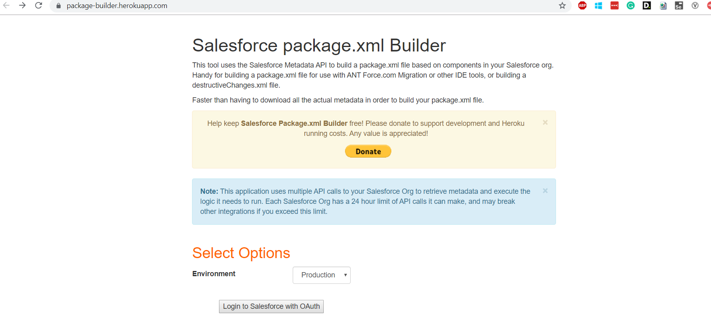

# Package Builder

Django application for listing all Metadata for a Salesforce Org. This app is designed to run on Heroku, but could be amended to run locally or any desired server

#Python
1) Install Python version 2.7
2) Install virtualenvwrapper-win if you have installed different Python version 

#Salesforce

3) Login in Salesforce Org in Lighting Experience
4) Setup> Apps> App Manager > New Connected App
  4.1 Complete required fields
  4.2 Enable OAuth Settings checked
  4.3 Save
  4.4 From API (Enable OAuth Settings) you will need Consume Key, Consumer Secret, Callback URL (heroku app url), API version

#Heroku
5) Create a Heroku account or you your own
6) (Optional) Install Heroku CLI
7) Using Shell navigate to project folder and run >  
    5.1 Login in Heroku: heroku login
    5.2 to deploy>git push heroku master

###Errors
If the deployment fails you will need to complete the following steps from your Heroku Account
8) Config Vars:{ProjectName} >Settings> Config Vars> add the following Vars
   DISABLE_COLLECTSTATIC = 1
   SALESFORCE_API_VERSION = Your ORG API VERSION
   SALESFORCE_CONSUMER_KEY = take it from the the step 2.4  "Consume Key"
   SECRET_KEY = take it from steps 2.4 "Consumer Secret"
9) Resources: add Heroku Postgress Database or Alternative DB and Heroku Redis both are free but you need to config a credit card.

###Logs
To view logs run > heroku logs --trail
